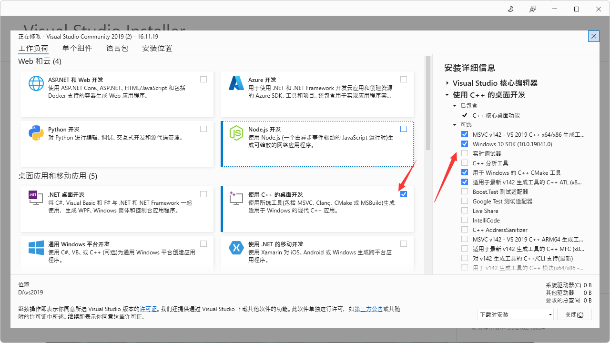

# Genshin-VitsWeb


## Feature

快速调用 Vits ;在 Web 生成语音

## 部署指南

| 软件名      | 下载链接    |
| ----------- | ----------- |
| Git         | [点我下载](https://ghproxy.com/github.com/git-for-windows/git/releases/download/v2.37.3.windows.1/Git-2.37.3-64-bit.exe)       |
| Miniconda   | [点我下载](https://repo.anaconda.com/miniconda/Miniconda3-latest-Windows-x86_64.exe)        |
如果你是小白 并且以上提及的几款软件你全都没装 [请看这里](install.md)

### Step 1 创建环境并克隆本仓库
---
```
conda create -n Genshin-Vits python=3.8 -y
conda activate Genshin-Vits
git clone https://github.com/HuanLinMaster/Genshin-VitsWeb
cd Genshin-VitsWeb
```

### Step 2 安装 Nodejs
---
```
conda install -c conda-forge nodejs
```

### Step 3 克隆 Vits 仓库并下载数据集
---
```
git clone --depth=1 https://github.com/Stardust-minus/vits
```
慢的话换成这个
```
git clone --depth=1 http://ghproxy.com/https://github.com/Stardust-minus/vits
```
或者这个
```
git clone --depth=1 http://gitclone.com/github.com/Stardust-minus/vits
```
自行下载 [数据集](https://obs.baimianxiao.cn/share/obs/sankagenkeshi/G_809000.pth) 并丢到vits目录内 ( ./vits )

### Step 4 安装 Vits 依赖及 Pytorch
--- 
以下命令需要在 ./Vits 目录内执行
```
pip install -r requirements.txt -i https://pypi.doubanio.com/simple/ --trusted-host pypi.doubanio.com
pip uninstall torch torchvision torchaudio
```

分情况讨论
> 如果你的电脑没有显卡或者你不想要用显卡
> 
> 执行
> 
> (Mac/Windows)
> ```
> pip3 install torch torchvision torchaudio
> ```
> (Linux)
> ```
> pip3 install torch torchvision torchaudio --extra-index-url https://> download.pytorch.org/whl/cpu
>```

> 如果你的电脑有显卡 <br>
> [在这里选择自己的显卡型号，下载安装](https://www.nvidia.cn/Download/index.aspx?lang=cn#) <br>
> [在这里下载CUDNN,需要注册](https://developer.nvidia.com/rdp/cudnn-download) <br>
> 复制 cuDNN bin 目录下的文件到 CUDA 的 bin 目录下（.dll） <br>
> 复制 cuDNN include 目录下的文件到 CUDA 的 include 目录下（.h） <br>
> 复制 cuDNN lib/x64 目录下的文件到 CUDA 的 lib/x64 目录下（.lib） <br>
> 添加环境变量，把 C:\Program Files\NVIDIA GPU Computing > Toolkit\CUDA\v10.1\lib\x64 加到 path 中 <br>

然后两种情况都需要的

安装Visual Studio2019的下面这些



重启电脑！！！一定要重启！！！

重启完了继续

进入 ./vits/monotonic_align/ 目录 执行
```
python setup.py build_ext --inplace
```
### Step 5 写入调用脚本
---
将下面的python文件写入 ./vits/gent.py (不存在 需自行创建) 内
```
import imp
import sys
import matplotlib.pyplot as plt
import IPython.display as ipd
import numpy as np
import scipy.io.wavfile as wav
print("开始")
import base64
import os
import json
import math
import torch
from torch import nn
from torch.nn import functional as F
from torch.utils.data import DataLoader

import commons
import utils
from data_utils import TextAudioLoader, TextAudioCollate, TextAudioSpeakerLoader, TextAudioSpeakerCollate
from models import SynthesizerTrn
from text.symbols import symbols
from text import text_to_sequence

from scipy.io.wavfile import write


def ToBase64(file):
    with open(file, 'rb') as fileObj:
        audio_data = fileObj.read()
        base64_data = base64.b64encode(audio_data)
        return (base64_data.decode())
# ToBase64("./output.wav")
def get_text(text, hps):
    text_norm = text_to_sequence(text, hps.data.text_cleaners)
    if hps.data.add_blank:
        text_norm = commons.intersperse(text_norm, 0)
    text_norm = torch.LongTensor(text_norm)
    return text_norm
hps_mt = utils.get_hparams_from_file("./configs/genshin.json")
npcList = ['派蒙', '凯亚', '安柏', '丽莎', '琴', '香菱', '枫原万叶',
           '迪卢克', '温迪', '可莉', '早柚', '托马', '芭芭拉', '优菈',
           '云堇', '钟离', '魈', '凝光', '雷电将军', '北斗',
           '甘雨', '七七', '刻晴', '神里绫华', '戴因斯雷布', '雷泽',
           '神里绫人', '罗莎莉亚', '阿贝多', '八重神子', '宵宫',
           '荒泷一斗', '九条裟罗', '夜兰', '珊瑚宫心海', '五郎',
           '散兵', '女士', '达达利亚', '莫娜', '班尼特', '申鹤',
           '行秋', '烟绯', '久岐忍', '辛焱', '砂糖', '胡桃', '重云',
           '菲谢尔', '诺艾尔', '迪奥娜', '鹿野院平藏']
device = ('cuda' if torch.cuda.is_available() else 'cpu')
net_g_mt = SynthesizerTrn(
    len(symbols),
    hps_mt.data.filter_length // 2 + 1,
    hps_mt.train.segment_size // hps_mt.data.hop_length,
    n_speakers=hps_mt.data.n_speakers,
    **hps_mt.model).to(device)
_ = net_g_mt.eval()

_ = utils.load_checkpoint("./G_809000.pth", net_g_mt, None)

# urls=(
#     '/','index',
# )
 
# class index:
#     def GET(self):
#         speaker = web.input().name
#         t_mt= web.input().content
#         print(speaker,t_mt)
#         stn_tst_mt = get_text(t_mt.replace("\n", ""), hps_mt)

#         with torch.no_grad():
#             x_tst_mt = stn_tst_mt.to(device).unsqueeze(0)
#             x_tst_mt_lengths = torch.LongTensor([stn_tst_mt.size(0)]).to(device)
#             sid_mt = torch.LongTensor([npcList.index(speaker)]).to(device)
#             audio_mt = net_g_mt.infer(x_tst_mt, x_tst_mt_lengths, sid=sid_mt, noise_scale=.667, noise_scale_w=.8, length_scale=1.2)[0][0,0].data.cpu().float().numpy()
#         wav.write("output.wav", hps_mt.data.sampling_rate, audio_mt)
#         # ipd.display(ipd.Audio(audio_mt, rate=hps_mt.data.sampling_rate, normalize=False))
#         #  open("./output.wav", 'rb')
#         return ToBase64("./output.wav")
 
# if __name__ == "__main__":
#     app = web.application(urls,globals())
#     app.run()
speaker = sys.argv[1]
t_mt=sys.argv[2]
try:
    noise = float(sys.argv[3])
except:
    noise = .667
try:
    noisew = float(sys.argv[4])
except:
    noisew = .8
try:
    length = float(sys.argv[5])
except:
    length = 1.2
stn_tst_mt = get_text(t_mt.replace("\n", ""), hps_mt)

with torch.no_grad():
    x_tst_mt = stn_tst_mt.to(device).unsqueeze(0)
    x_tst_mt_lengths = torch.LongTensor([stn_tst_mt.size(0)]).to(device)
    sid_mt = torch.LongTensor([npcList.index(speaker)]).to(device)
    audio_mt = net_g_mt.infer(x_tst_mt, x_tst_mt_lengths, sid=sid_mt, noise_scale=noise, noise_scale_w=noisew, length_scale=1.2)[0][0,0].data.cpu().float().numpy()
wav.write("output.wav", hps_mt.data.sampling_rate, audio_mt)
print("生成完毕")
# ipd.display(ipd.Audio(audio_mt, rate=hps_mt.data.sampling_rate, normalize=False))

```

### Step 6 开启服务端
---
回到项目目录
```
npm i --registry=https://registry.npmmirror.com/
node ./app.js
```
默认端口8881